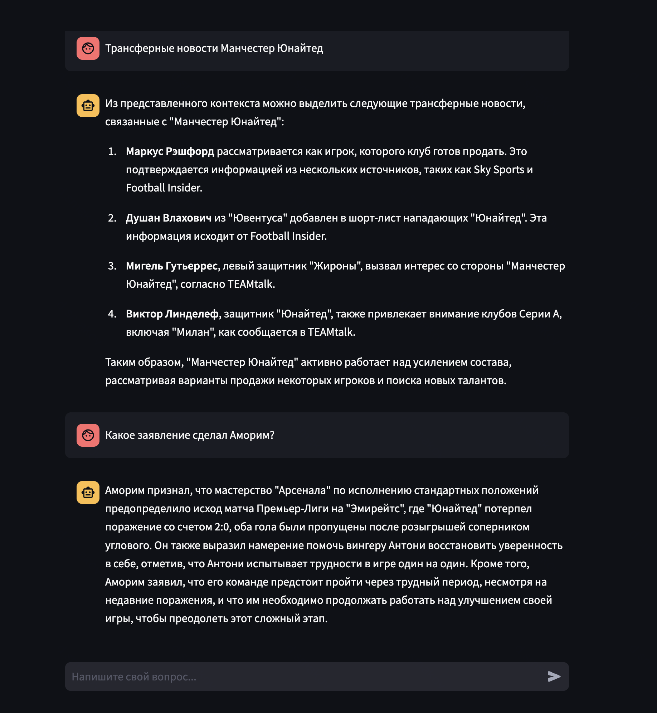

# fapl RAG

Content for project is based on data from resource: **https://fapl.ru**

Repository structure
------------

    ├── README.md                   <- project description
    │
    ├── experiments                 <- jupyter notebooks with experiments
    │
    ├── airlfow_local               <- airflow for ETL
    │
    ├── data                        <- extension for vector database
    │
    ├── interface                   <- backend of the service
    │
    ├── streamlit                   <- streamlit front
    |
    ├── utils                       <- some database and airlow utils scripts
    │
    └── requirements.txt            <- requirements

--------

## How to run the project

1. Clone the repository:

    `git clone <repository_url>`
    `cd <repository_directory>`

2. Configure your embedder:

At interface/config.yaml set values for parameters for embedding model.

File interface/config.yaml lets you change the experimental parameters. 

 
3. Setup the project:

For project preparation we must load some data via airflow

    make setup

After building Airflow containers, one must trigger DAG "load_data_to_db"

4. Update .env

Create .env file with API key to GigaChat:

    LLM_API_KEY = <gigachat_API_key>

5. Run the project

    `make run`

Interface will be available at http://localhost:8501

## Interface

The interface is a chat with an LLM assistant, containing the history of the dialogue and a field for entering a question.

